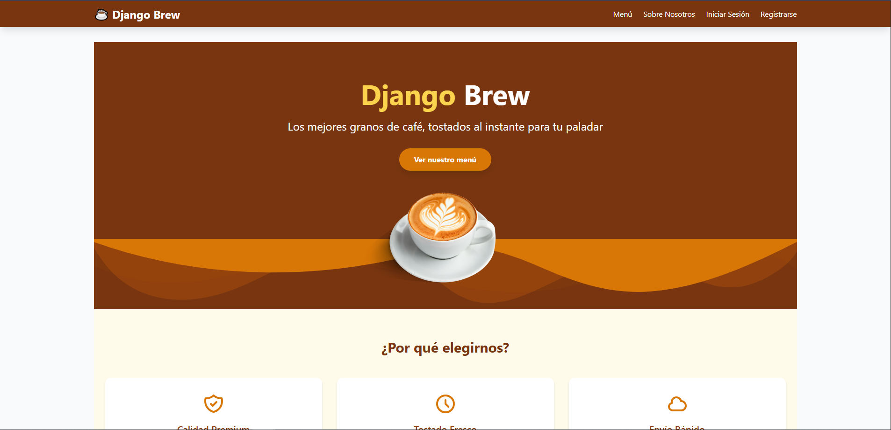
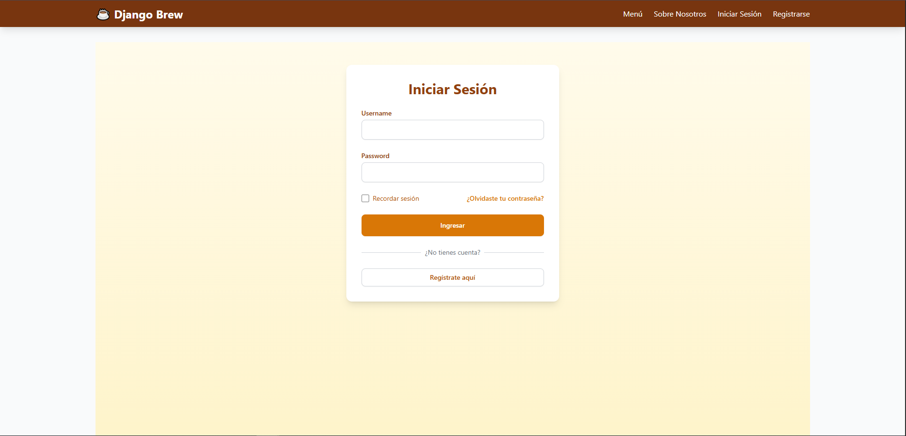
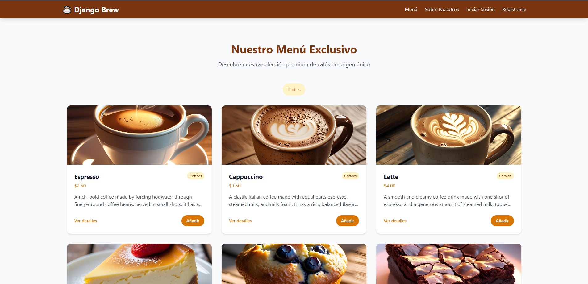
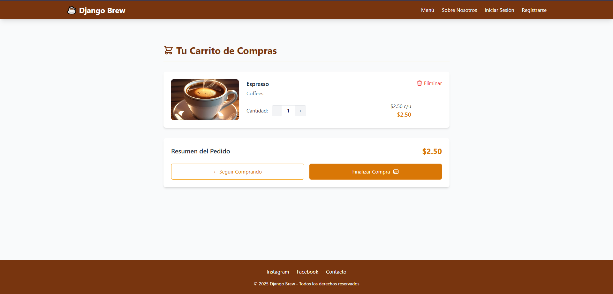
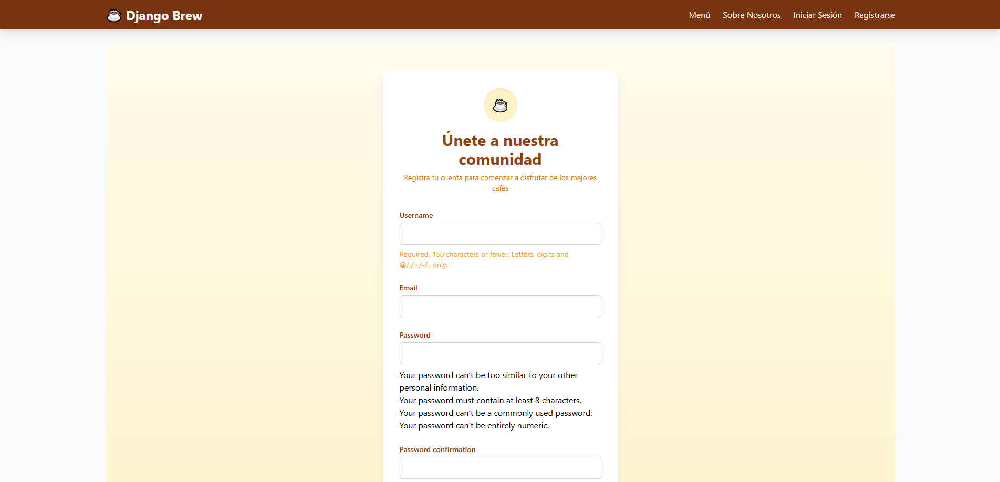

# **Django CoffeeShop** ☕

[]()
[]()
[]()

Proyecto Django completo para gestión de cafetería, desarrollado como parte del curso de Django de Platzi. Implementa PostgreSQL como base de datos y utiliza variables de entorno para configuración sensible.

## 🖥️ **Demo** 






*(Próximamente más capturas de pantalla y demo en vivo)*

## ✨ **Características**

- Catálogo de productos con imágenes
- Sistema de pedidos
- Autenticación de usuarios
- Panel administrativo personalizado
- Diseño responsive con Tailwind CSS
- Animaciones CSS personalizadas
- Configuración mediante variables de entorno

## 🛠️ **Stack Tecnológico**

### Backend
- Python 3.12.3
- Django 5.2.3
- PostgreSQL (psycopg2-binary 2.9.10)
- django-environ 0.12.0
- Pillow 11.2.1 (manejo de imágenes)

### Frontend
- Tailwind CSS
- CSS personalizado
- HTML5 semántico

### Desarrollo
- Entornos virtuales (venv)
- requirements.txt para dependencias

## 🚀 **Instalación Local**

1. **Clonar el repositorio**:
   ```bash
   git clone https://github.com/gaborgr/django-coffeeshop.git
   cd django-coffeeshop
   ```
2. Configurar entorno virtual:
   ```bash
   python -m venv venv
    source venv/bin/activate  # Linux/Mac
    # ó
    venv\Scripts\activate     # Windows
   ```
3. Instalar dependencias:
   ```bash
   pip install -r requirements.txt
   ```
4. Configurar variables de entorno:
   ```bash
   cp .env.example .env
   # Editar .env con tus credenciales
   ```
5. Configurar base de datos PostgreSQL:
  - Crear una base de datos llamada `django_coffeeshop`
  - Configurar usuario y contraseña en `.env`
6. Migraciones y usuario inicial:
   ```bash
   python manage.py migrate
   python manage.py createsuperuser
   ```
7. Ejecutar servidor de desarrollo:
   ```bash
   python manage.py runserver
   ```

## 📂 **Estructura del Proyecto**

  ```text
  django-coffeeshop/
  ├── coffeeproject/       # Configuración principal del proyecto
  ├── products/            # App de productos
  ├── orders/              # App de pedidos
  ├── accounts/            # Autenticación de usuarios
  ├── static/              # Archivos estáticos (CSS, JS, imágenes)
  │   └── images/          # Imágenes del proyecto
  ├── templates/           # Templates base
  ├── docs/                # Documentación
  │   └── images/          # Capturas de pantalla para README
  ├── .env.example         # Ejemplo de variables de entorno
  ├── requirements.txt     # Dependencias del proyecto
  └── manage.py            # Punto de entrada
  ```

## 👨‍💻 **Desarrollo Futuro**

### Próximas características
- Sistema de reservas de mesas
- Carrito de compras mejorado
- Integración con pasarela de pagos
- API REST para móviles

### Mejoras planeadas
- Tests automatizados
- GitHub Actions para CI/CD
- Dockerización del proyecto
- Documentación técnica extensa

## 🤝 **Cómo Contribuir**

Actualmente aceptamos contribuciones siguiendo estos pasos:

1. Haz fork del proyecto
2. Crea tu branch (`git checkout -b feature/nueva-funcionalidad`)
3. Haz commit de tus cambios (`git commit -m 'Añade nueva funcionalidad'`)
4. Haz push al branch (`git push origin feature/nueva-funcionalidad`)
5. Abre un Pull Request

*Próximamente añadiremos guías más detalladas para contribuciones.*

## 📄 Licencia

Distribuido bajo licencia MIT. Ver `LICENSE` para más información.

## 🙏 Reconocimientos

- Curso de Django de Platzi como base de conocimiento
- Comunidad de Django por su excelente documentación

## 📧 Contacto

Gabriel Guerra - [@gaborgr](https://github.com/gaborgr) - [gguerra.code@gmail.com](mailto:gguerra.code@gmail.com)

Enlace del proyecto: [https://github.com/gaborgr/django-coffeeshop](https://github.com/gaborgr/django-coffeeshop)
